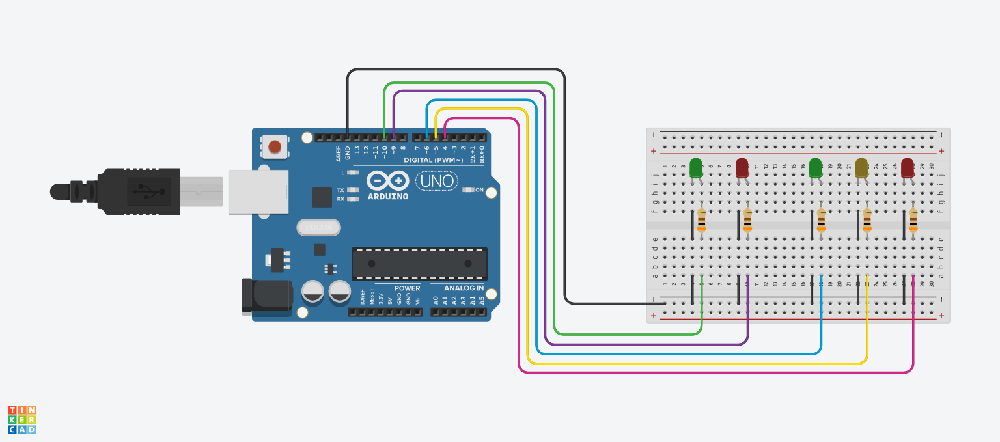

# Protótipo de Semáforo

Este projeto tem como objetivo simular o funcionamento de um semáforo de trânsito, contemplando a sinalização tanto para pedestres como para veículos. O sistema é dividido em dois conjuntos independentes de LEDs , responsáveis por indicar as condições de circulação de cada grupo. 

  
 

A sinalização destinada aos veículos segue o modelo tradicional utilizado no trânsito: vermelho (pare), amarelo (atenção) e verde (siga), respeitando tempos pré-definidos para cada estado. Já a sinalização para pedestres opera de forma sincronizada com o semáforo veicular. 

 

Além do funcionamento convencional, o sistema de pedestres inclui um alerta visual, no qual o LED vermelho pisca antes do encerramento do período de travessia, indicando que o sinal está prestes a fechar. Esse comportamento aproxima a simulação do funcionamento real dos semáforos urbanos. 

---
## Componentes utilizados
  - Arduino Uno (1x)
  - LED Verde 5 mm (2x)
  - LED Vermelho 5 mm (2x)
  - LED Amarelo 5 mm (1x)
  - Resistor 300 Ω (5x)
  - Protoboard (1x)
  - Jumpers

---
## Esquemático do Circuito

  

 

**Legenda:**
  - D4 -> LED Vermelho à Direita
  - D5 -> LED Amarelo à Direita
  - D6 -> LED Verde à Direita
  - D9 -> LED Vermelho à Esquerda
  - D10 -> LED Verde à Esquerda
  - Resistores: 300 Ω

---
## Montagem e Funcionamento

  

 

🎥 **Vídeo do Funcionamento:**  
👉 [Acesse clicando aqui!](https://youtu.be/SsBZyAJXiDw)

---
## Código do Projeto
Quer ver como esse projeto foi programado?  
👉 [Acesse o código clicando aqui!](src/Semaforo.ino)
